<div align="center">

# 🤖 Robot Ops Platform

https://landfall-superglue-sequence.ngrok-free.dev/

> 실시간 로봇 텔레메트리를 수집·분석하고,
> 이상 상황 탐지부터 운영자 조치까지 지원하는
> AI 기반 Fleet Operations Platform

</div>

<div align="center">

다수의 로봇을 운영하는 환경에서는 단순히 현재 상태를 확인하는 것보다

- 어떤 장비에 문제가 발생했는지
- 어떤 문제를 가장 먼저 확인해야 하는지
- 왜 문제가 발생했는지
- 운영자가 어떤 조치를 해야 하는지

를 빠르게 판단하는 것이 중요합니다.

Robot Ops Platform은 이러한 운영 흐름을

**탐지 → 분석 → 우선순위 판단 → 운영자 조치 → 해결**

까지 하나의 시스템에서 지원하는 것을 목표로
MQTT → Kafka → Redis/PostgreSQL → WebSocket 기반의 실시간 데이터 파이프라인을 구성하고,
이벤트 탐지, Risk Score 계산, AI 분석, 운영 대응 Workflow,
일일 PDF 리포트까지 구현했습니다.


</div>

<div align="center">

**개발 기간** 2026.04.16 ~ 2026.08.16 (약 4개월) · **개발 인원** 1인 (기획·설계·백엔드·프론트엔드·인프라 전 영역 단독 개발)

</div>

<div align="center">


</div>

<div align="center">

## 🌐 배포 구조

</div>

이 프로젝트는 별도의 클라우드 인프라 없이,
**로컬 환경에서 전체 스택을 Docker Compose로 구동한 뒤
ngrok Tunnel을 통해 외부에서 접근 가능한 형태로 운영**하고 있습니다.

```text
[로봇 시뮬레이터] → [로컬 Docker Compose 스택]
         (Backend / Frontend / Kafka / Redis / PostgreSQL)
                              ↓
                        [ngrok Tunnel]
                              ↓
        https://landfall-superglue-sequence.ngrok-free.dev/
```

- AWS/GCP 등 클라우드 배포 대신 ngrok을 택한 이유는,
  Kafka·Redis·MQTT 등 다중 컨테이너 스택을 저비용으로
  검증 가능한 형태로 외부에 공유하기 위함이었습니다.
- `infra/.env`의 `NGROK_AUTHTOKEN` 설정 시
  `docker compose up` 만으로 터널이 함께 기동됩니다.
- 상시 가동 서버가 아니므로, 데모 접속이 안 될 경우
  로컬 실행([Getting Started](#-getting-started) 참고)을 권장드립니다.

---


---
## 📑 목차

- [Demo](#️-demo)
- [Capacity Planning](#-capacity-planning)
- [핵심 성과](#-핵심-성과)
- [Architecture](#-architecture)
- [Core Features](#-core-features)
- [Troubleshooting](#-troubleshooting)
    - [Kafka](#kafka)
    - [Redis](#redis)
- [Tech Stack](#-tech-stack)
- [Technical Decisions](#-technical-decisions)
- [Getting Started](#-getting-started)
---

<div align="center">

## 🖥️ Demo

</div>

<div align="center">


</div>

<div align="center">

### 🤖 관제 코파일럿

전체 로봇의 상태와 이상 징후를 실시간으로 모니터링합니다.

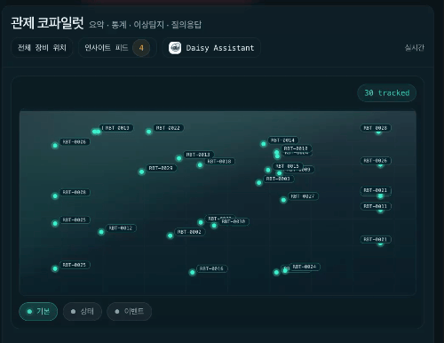

</div>

---

<div align="center">

### 🧠 Insight Feed

탐지된 이상 징후를 기반으로 현재 상황, 가능한 원인과 권장 조치를 제공합니다.

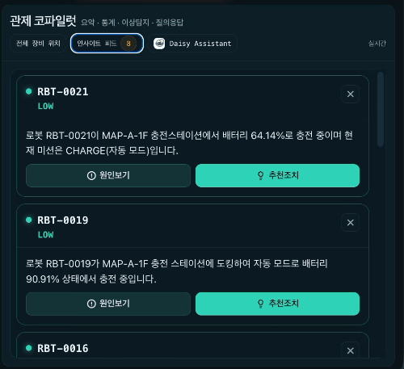

</div>

---

<div align="center">

### 🌼 Daisy Assistant

실제 관제 데이터를 기반으로 운영 현황 조회 및 대응을 지원합니다.

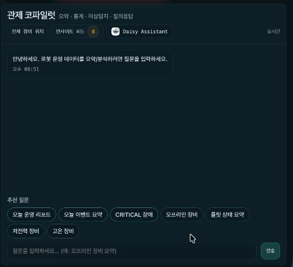

</div>

---

<div align="center">

### 🔍 디바이스 상세

개별 로봇의 상태, Telemetry와 발생 이벤트를 상세 조회합니다.

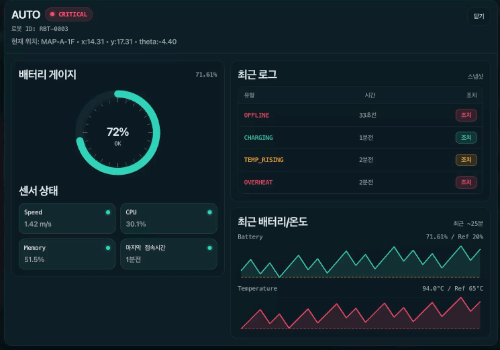

</div>

---

<div align="center">

### ✅ 이벤트 조치

이벤트 확인부터 ACK, 체크리스트 수행, 해결까지 운영 조치 Workflow를 제공합니다.

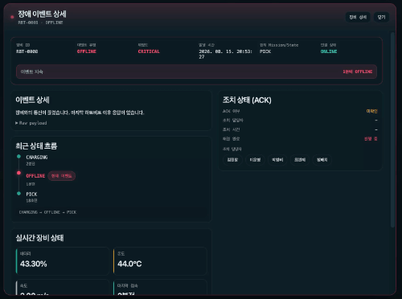

</div>

---

<div align="center">

### 📊 생산량 & 가동률

실시간 Throughput과 Utilization을 집계하여 운영 KPI를 제공합니다.

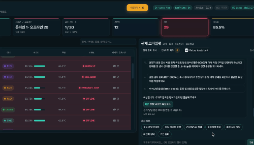

</div>

---

<div align="center">

## 📌 Capacity Planning

실제 로봇 운영 환경을 가정하여 예상 트래픽과 인프라 기준을 먼저 설정한 뒤,
부하 테스트를 통해 해당 조건에서 시스템이 안정적으로 동작하는지 검증했습니다.

### 예상 트래픽

- 운영 로봇: 30대
- Telemetry 전송 주기: 장비당 1회/sec
- 평시 Telemetry 유입량: 약 30 msg/s
- 순간 장애/재연결을 고려한 예상 Peak: 100~150 msg/s
- Dashboard 조회: 최대 100 VU 기준으로 검증
- 향후 확장 시나리오: 300~500 msg/s 구간까지 Stress Test

</div>

---

<div align="center">

## 📈 핵심 성과

| 개선 항목 | Before | After |
|---|---:|---:|
| AI Feed End-to-End Latency | 60~100초 | **약 10초** |
| Kafka Consumer Lag | 10~40건 | **0~1건** |
| Redis AVG (1,000 devices) | 74.199ms | **19.503ms** |
| Redis P95 (1,000 devices) | 189.881ms | **40.182ms** |

</div>


---

<div align="center">

## 🏗 Architecture

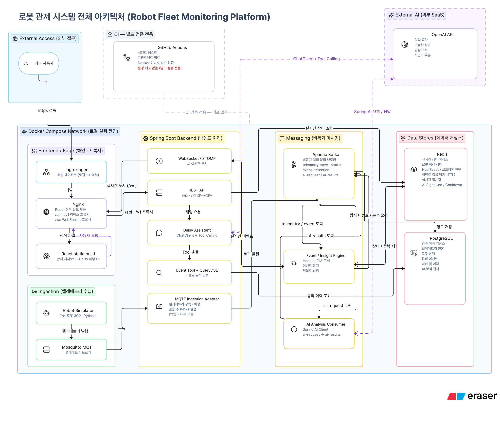

</div>

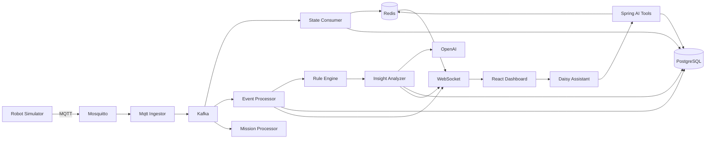

<div align="center">

## 📚 Development Details

</div>

<details>
<summary><b>프로젝트 구조 및 상세 데이터 흐름 보기</b></summary>

#### 프로젝트 구조

```
robot-ops-platform/
├── frontend/          # React SPA (Vite)
├── backend/           # Spring Boot API 서버
├── simulator/         # MQTT 로봇 텔레메트리 시뮬레이터 (Python)
└── infra/             # Docker Compose, Prometheus, Grafana 설정
    ├── docker-compose.yml
    ├── prometheus/
    └── grafana/
```

#### 데이터 흐름

```
로봇/시뮬레이터
    │ MQTT (telemetry)
    ▼
Backend (MqttIngestor)
    │ 저장 / 분석
    ├── PostgreSQL (이력)
    ├── Redis (실시간 상태·이벤트)
    ├── Kafka (이벤트 스트리밍)
    └── WebSocket → Frontend (실시간 UI)
```

1. Simulator가 MQTT Telemetry 발행
2. MqttIngestor가 메시지 수신
3. Kafka Topic으로 Telemetry 전달
4. Consumer 처리
    - PostgreSQL → 이력 저장
    - Redis → 최신 상태 저장
    - Throughput / Utilization 계산
5. Rule Engine → 이벤트 탐지
6. Insight Analyzer → Risk Score 계산 + OpenAI 분석
7. WebSocket → Dashboard 실시간 Push

#### Event / Insight 처리 흐름

MQTT 1건 수신 시 `TelemetryEventPublisher`가 **Event**와 **Insight** 파이프라인을 각각 Kafka topic으로 fan-out 합니다.

##### Event — 이상 이벤트 탐지

```text
MqttIngestor
  → TelemetryService
  → TelemetryEventPublisher.publishDeviceEvent()
  → Kafka [robot.device.event]

DeviceEventConsumer
  → EventContext(TelemetryPayload, RedisSnapshotBuilder.build())
  → EventEngine.process()
      → EventHandler.evaluate()          # RealtimeRule / StatefulRule
      → DeviceEvent
  → RedisSyncService.countSync()
  → KafkaProducer.sendDeviceEvent()
  → Kafka [robot.device.event.detected]

DeviceEventDetectConsumer
  → DeviceEventService.process()
      → RedisService.tryAcquire()        # 중복 이벤트 방지
      → DeviceEventRepository.save()   # PostgreSQL
      → KafkaProducer.sendAllEvents()
  → Kafka [robot.device.events]

DashBoardConsumer
  → WebsocketService.broadcastAllEvents()
```

| 클래스 | 역할 |
|---|---|
| `EventHandlerRegistry` | OFFLINE, OVERHEAT, LOW_BATTERY 등 `EventHandler` Bean 등록 |
| `EventHandler` | Rule 통과 시 `DeviceEvent` 생성 |
| `EventEngine` | 등록된 Handler 순회 → 탐지된 이벤트 목록 반환 |
| `RealtimeRule` / `StatefulRule` | Telemetry + Redis 스냅샷 기준 임계값·추세 Rule |

##### Insight — AI Feed 생성

```text
MqttIngestor
  → TelemetryService
  → TelemetryEventPublisher.publishInsight()
  → Kafka [robot.device.feed.detect]

InsightAiConsumer.detectInsight()
  → EventContext(TelemetryPayload, RedisSnapshotBuilder.build())
  → InsightAnalyzer.analyze()
      → InsightEngine.process()
          → InsightHandler.evaluate()    # RealtimeRule / StatefulRule
          → DeviceInsightResponse
      → RiskCalculator.calculate()
      → InsightFeedResponse
  → AiPublishService.publishIfNeeded()
      → RedisService                     # 변화 감지 / 2분 cooldown
      → KafkaProducer.sendInsightFeed()
  → Kafka [robot.device.feed]            # key = robotId

InsightAiConsumer.sendInsightOpenAI()    # group: openAi
  → OpenAiClient.request()
  → KafkaProducer.createAiAnalysis()
  → Kafka [robot.device.feed.analysis]

InsightAiConsumer.saveAiAnalysis()       # group: db
  → AiAnalysisService.saveAiAnalysis()
  → PostgreSQL (AiAnalysisInsight)

InsightAiConsumer.sendAiAnalysis()     # group: ws
  → WebsocketService.broadcastInsightFeed()
```

| 클래스 | 역할 |
|---|---|
| `InsightHandlerRegistry` | OFFLINE, OVERHEAT 등 `InsightHandler` Bean 등록 |
| `InsightHandler` | Rule 통과 시 `DeviceInsightResponse` 생성 |
| `InsightEngine` | 등록된 Handler 순회 → Insight 후보 목록 반환 |
| `InsightAnalyzer` | Insight + Risk Score → `InsightFeedResponse` 조립 |
| `AiPublishService` | 상태 변화·cooldown 필터 후 Kafka publish |

> Event와 Insight는 **동일한 Rule(`RealtimeRule`, `StatefulRule`)** 을 공유하지만,
> Event는 `DeviceEvent` + 운영자 조치 Workflow,
> Insight는 `InsightFeedResponse` + OpenAI 분석 Feed로 **목적에 따라 분기**됩니다.

---

</details>

<div align="center">

## ✨ Core Features

</div>

#### 실시간 Fleet Monitoring

- MQTT 기반 로봇 Telemetry 수집
- Redis 기반 최신 Device State 관리
- WebSocket(STOMP)을 통한 실시간 Dashboard 갱신
- 배터리, 온도, CPU, 속도, 위치, Mission 상태 표시

#### Event Detection

다음 이상 이벤트를 탐지합니다.

- OFFLINE
- LOW_BATTERY
- OVERHEAT
- EMERGENCY_STOP
- COLLISION
- OBSTACLE
- CPU_RISING
- TEMP_RISING
- SPEED_RISING
- IDLE
- CHARGING

Redis 기반 중복 방지 로직을 적용하여
동일 이벤트의 반복 생성을 억제합니다.

#### Risk-based Priority

운영자가 먼저 확인해야 할 장비를 다음 정책으로 정렬합니다.

1. 해결되지 않은 CRITICAL 이벤트 존재 여부
2. Risk Score
3. 최근 이벤트 발생 시간

#### AI Insight

Telemetry와 탐지된 Insight를 기반으로

- 현재 상황
- 가능한 원인
- 권장 조치

를 AI가 생성합니다.

#### Operator Action Workflow

이벤트 발생 이후 단순 알림으로 끝나지 않고

OPEN → ACKNOWLEDGED → 체크리스트 수행 → 상태 재확인 → RESOLVED

흐름으로 운영 조치를 관리합니다.

#### Daisy Assistant

Spring AI Tool Calling을 활용하여
실제 Redis/PostgreSQL 데이터를 조회하고 자연어 질문에 답변합니다.

#### Daily Operations Report

운영 KPI, 생산량, 가동률, 이벤트,
위험 장비, AI 분석을 종합하여 PDF 보고서를 생성합니다.

---

<div align="center">

## 🔥 Troubleshooting

</div>

<div align="center">

### Kafka

**Consumer Lag 약 40건 → 0~1건 / End-to-End Latency 약 60~100초 → 약 10초**

</div>

<details>
<summary><b>상세 트러블슈팅 과정 보기</b></summary>

<br>

#### 1. 문제 상황

로봇 관제 시스템에서 중요하게 생각한 목표 중 하나는
**로봇의 이상 징후를 빠르게 감지하고, 운영자가 원인과 조치 방법까지 빠르게 확인할 수 있도록 하는 것**이었습니다.

MQTT로 수신한 로봇 상태를 `EventEngine`과 `InsightEngine`에서 분석하고,
의미 있는 이상 징후를 `InsightFeed`로 생성했습니다.

이후 OpenAI를 통해 이상 발생 원인과 권장 조치를 생성하여 WebSocket으로 화면에 전달하도록 구성했습니다.

초기 처리 구조는 다음과 같았습니다.

```text
MQTT
 → 이상 징후 감지
 → OpenAI 분석
 → DB 저장
 → WebSocket
```

구간별 처리 시간을 측정한 결과 객체 생성, DB 저장, WebSocket 전송은 수 ms 수준이었던 반면,
**OpenAI API 호출에는 평균 약 6~7초가 소요**되었습니다.

외부 API 응답을 기다리는 동안 전체 처리 흐름이 블로킹되는 구조는 실시간 관제에 적합하지 않다고 판단하여,
OpenAI 분석 구간을 Kafka Consumer로 분리해 비동기로 처리하도록 변경했습니다.

```text
MQTT
 → 이상 징후 감지
 → Kafka Publish
      ↓
 Kafka Consumer
 → OpenAI 분석
 → DB 저장
 → WebSocket
```

---

#### 2. 1차 문제 — 과도한 메시지 유입으로 Consumer Lag 발생

Kafka를 통해 OpenAI 호출을 비동기로 분리하면 느린 외부 API가 앞단의 실시간 데이터 처리에 미치는 영향을 줄일 수 있을 것으로 예상했습니다.

그러나 Kafka UI에서 Consumer Lag를 확인한 결과,
**10분 동안 약 999건의 Lag가 누적**되는 문제가 발생했습니다.

<div align="center">
  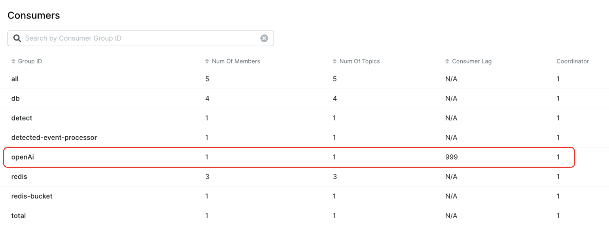
</div>

원인을 분석한 결과 30대의 로봇이 지속적으로 전송하는 MQTT 데이터를 대부분 AI 분석 대상으로 발행하고 있었습니다.

실시간 시스템이라는 이유로 가능한 많은 데이터를 즉시 처리하려 했지만, 실제 운영자가 확인해야 하는 것은 모든 Telemetry가 아니라
**의미 있는 상태 변화와 이상 징후**였습니다.

따라서 Kafka로 전달되는 메시지 자체를 줄이기 위해 다음 조건을 적용했습니다.

- 이전 상태와 동일한 경우 새로운 Feed 생성 제외
- 이미 감지된 `OFFLINE` 등의 이벤트 중복 발행 방지
- AI Feed 생성 후 2분간 Cooldown 적용
- 의미 있는 상태 변화가 발생한 경우에만 AI 분석 메시지 발행

이를 통해 **불필요한 OpenAI 요청과 Kafka 메시지 유입량 자체를 감소**시켰습니다.

---

#### 3. 2차 문제 — Consumer Concurrency 증가 후에도 Lag 지속

불필요한 메시지를 제거한 이후에도 Consumer Lag가 지속적으로 발생했습니다.

OpenAI 호출은 한 건당 약 6~7초가 필요한 I/O 작업이므로 Consumer 처리량을 높이기 위해 Kafka Listener의 `concurrency`를 증가시켰습니다.

```text
concurrency: 1 → 3
```

메시지 유입량 감소와 Consumer worker 증가를 통해 Lag가 크게 감소했지만,
**여전히 약 10~20건의 Lag가 남았으며 기대했던 수준의 병렬 처리 효과가 나타나지 않았습니다.**

<div align="center">
  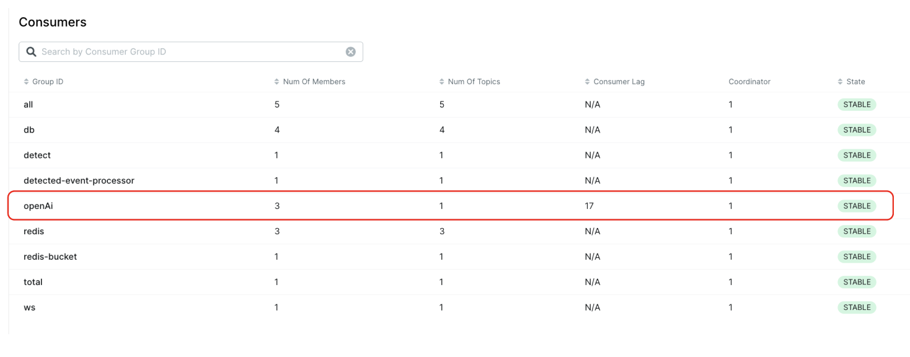
</div>

따라서 단순히 worker를 추가하는 것만으로는 해결되지 않는다고 판단하고,
실제 메시지가 어느 구간에서 대기하고 있는지 확인하기 위해 전체 처리 시간을 구간별로 측정했습니다.

---

#### 4. 병목 추적 — 실제 처리시간 7초, End-to-End는 최대 100초

Prometheus를 이용해 Feed 처리 사이클의 각 구간을 측정했습니다.

```text
Kafka Publish
 → Detect
 → OpenAI
 → DB Save
 → WebSocket
```

<div align="center">
  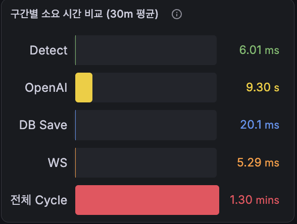
</div>

측정 결과 각 처리 구간의 합은 약 **6~7초**였습니다.

하지만 MQTT 이벤트 발생부터 최종 Feed가 화면에 전달되기까지는
**약 1분, 길게는 1분 40초**가 소요되고 있었습니다.

```text
실제 처리 시간       약 6~7초
End-to-End Latency   약 60~100초
```

즉, 약 50초 이상의 시간이 기존 애플리케이션 처리시간 측정만으로는 설명되지 않았습니다.

추가로 메시지의 Publish 시점과 Consumer 처리 시작 시점을 추적한 결과, 해당 지연은 실제 연산 시간이 아니라

> **`robot.device.feed` Topic에 메시지가 발행된 후 OpenAI Consumer가 메시지를 가져가기까지 기다리는 Queueing Delay**

에서 발생하고 있음을 확인했습니다.

따라서 핵심 병목은 OpenAI API의 6~7초 응답시간 자체뿐만 아니라,
**Consumer 처리량이 Producer 유입량을 따라가지 못해 메시지가 Kafka에서 대기하는 시간**에 있었습니다.

---

#### 5. 근본 원인 — Concurrency는 증가했지만 Partition은 1개

`concurrency`를 증가시켰는데도 처리량이 충분히 증가하지 않는 원인을 확인하기 위해
Docker 내부 Kafka의 Consumer Group과 Partition Assignment를 확인했습니다.

<div align="center">
  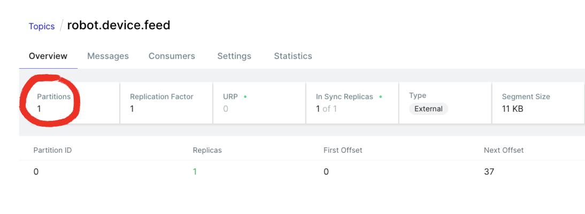
</div>

```text
GROUP    TOPIC              PARTITION  CURRENT-OFFSET  LOG-END-OFFSET  LAG  CONSUMER-ID
openAi   robot.device.feed  0          22              45              23   consumer-openAi-4-...
```

여러 Consumer worker가 메시지를 병렬로 처리하고 있을 것으로 예상했지만 실제로는
**특정 Consumer 하나에만 Partition이 할당되어 있었고 해당 Consumer에 Lag가 집중**되고 있었습니다.

원인은 `robot.device.feed` Topic의 **Partition이 1개뿐이었던 것**이었습니다.

```text
Partition = 1
Concurrency = 3

Partition 0 → Consumer 1
Consumer 2 → idle
Consumer 3 → idle
```

Kafka에서는 동일 Consumer Group 내에서 하나의 Partition을 여러 Consumer가 동시에 나누어 처리할 수 없습니다.

따라서 Consumer concurrency를 증가시키더라도

> **실제 병렬 처리 가능한 Consumer 수의 상한은 Partition 수에 의해 제한됩니다.**

```text
실제 병렬 처리 가능한 Consumer 수 ≤ Partition 수
```

즉, `concurrency=3`으로 worker를 증가시켰음에도 Partition이 하나였기 때문에
실제로 메시지를 처리할 수 있는 Consumer는 하나뿐이었습니다.

---

#### 6. 개선 — Partition 확장으로 실제 Consumer 병렬성 확보

병목 원인을 확인한 후 `robot.device.feed` Topic의 Partition 수를 확장하고 Consumer concurrency를 조정했습니다.

**Before**

```text
Partition   = 1
Concurrency = 3

Partition 0 → Consumer 1
              Consumer 2 → idle
              Consumer 3 → idle
```

**After**

```text
Partition   = 6
Concurrency = 6

Partition 0 → Consumer 1
Partition 1 → Consumer 2
Partition 2 → Consumer 3
Partition 3 → Consumer 4
Partition 4 → Consumer 5
Partition 5 → Consumer 6
```

<div align="center">
  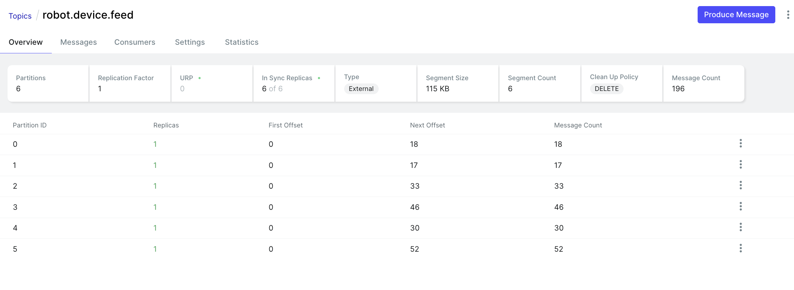
</div>

Partition과 concurrency가 반드시 동일해야 하는 것은 아니지만,
**이번 테스트에서는 최대 6개의 작업을 병렬 처리할 수 있도록 각각 6으로 설정했습니다.**

또한 Kafka 메시지 Key를 `robotId`로 지정했습니다.

이를 통해 동일 로봇에서 발생한 메시지는 동일 Partition으로 전달되어 **로봇 단위의 메시지 순서를 유지**하면서도,
서로 다른 로봇의 메시지는 여러 Partition으로 분산되어 병렬 처리될 수 있도록 구성했습니다.

최종 처리 구조는 다음과 같습니다.

```text
MQTT
 ↓
상태 변화 / 중복 / Cooldown 필터링
 ↓
Kafka Publish (key = robotId)
 ↓
6 Partitions
 ↓
6 Consumer Workers
 ↓
OpenAI
 ↓
DB Save
 ↓
WebSocket
```

---

#### 7. 개선 결과

동일한 조건에서 데이터를 초기화한 후 다시 10분간 테스트했습니다.

<div align="center">
  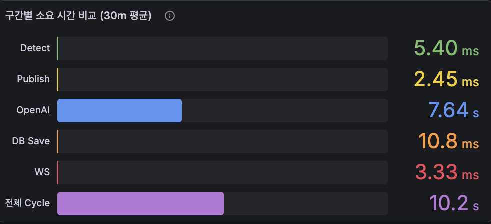
</div>

| 지표 | 개선 전 | 개선 후 |
| --- | ---: | ---: |
| End-to-End 처리시간 | 약 60~100초 | **약 10초** |
| Consumer Lag | 최소 10건 ~ 최대 40건 | **0~1건** |
| 실질적으로 동작하는 Consumer | 1개 | **최대 6개** |
| Partition | 1개 | **6개** |

기존에 약 50초까지 발생하던 Kafka Queueing Delay가 크게 감소하면서,
전체 처리시간 역시 OpenAI 자체 처리시간에 가까운 수준까지 줄일 수 있었습니다.

---

#### 8. 배운 점

처음 Kafka를 도입한 목적은 느린 OpenAI 호출을 메인 처리 흐름에서 분리하여 비동기로 처리하는 것이었습니다.

하지만 이번 문제를 통해 **비동기 구조로 변경하는 것 자체가 처리량 향상을 보장하지는 않는다는 점**을 확인했습니다.

Producer의 메시지 유입 속도가 Consumer의 처리 속도보다 빠르면 Kafka 내부에 메시지가 계속 대기하게 되고, 이는 결국 End-to-End Latency 증가로 이어집니다.

또한 Consumer의 `concurrency`를 증가시키는 것만으로 병렬성이 확보되는 것이 아니라,
**Partition 수가 실제 Consumer 병렬 처리량의 상한을 결정한다는 점**을 Consumer Group의 Partition Assignment를 통해 확인했습니다.

특히 처음에는 OpenAI의 6~7초 응답시간을 가장 큰 문제라고 생각했지만, 구간별 처리시간을 측정하면서 실제로는 **Kafka 내부에서 약 50초의 Queueing Delay가 추가로 발생하고 있다는 사실**을 발견했습니다.

이번 트러블슈팅을 통해 다음과 같은 방식으로 성능 문제를 추적하는 경험을 할 수 있었습니다.

```text
End-to-End Latency 측정
        ↓
구간별 처리시간 분해
        ↓
Queueing Delay 발견
        ↓
Consumer Group / Partition 확인
        ↓
병목 원인 제거
        ↓
동일 조건 재측정
```

또한 실시간 시스템에서는 모든 데이터를 최대한 빠르게 처리하는 것보다
**서비스 목적에 필요한 데이터를 선별하고 downstream 시스템이 감당할 수 있는 수준으로 유입량을 제어하는 것 역시 중요한 설계 요소**라는 점을 확인했습니다.

현재는 30대의 로봇을 기준으로 테스트했으며, 향후 100대 이상의 부하 환경에서도 `Producer 유입량`, `Consumer 처리량`, `Partition별 Lag`, `End-to-End Latency`를 측정하여 현재 구조의 처리 한계를 확인할 계획입니다.

</details>

<div align="center">

### Redis

**1,000대 기준 AVG 74.199ms → 19.503ms (약 73.7% 감소) / P95 189.881ms → 40.182ms (약 78.8% 감소)**

</div>

<details>
<summary><b>상세 트러블슈팅 과정 보기</b></summary>

<br>

#### 1. 문제 상황 — 장비 수만큼 반복되는 Redis 조회

Dashboard에서는 각 로봇의 최근 15분 가동률(Utilization)을 조회하여 화면에 제공하고 있습니다.

기존에는 DB에서 전체 `deviceId`를 조회한 뒤 각 장비별로 Redis Hash를 개별 조회하는 구조였습니다.

```java
public List<UtilizationResponse> getUtilization() {

    List<String> deviceIdList =
            deviceStateRepository.findAllDeviceId();

    long currentBucketStart =
            redisService.currentBucketStart()
                    .toInstant()
                    .toEpochMilli();

    return deviceIdList.stream()
            .map(deviceId -> {

                Map<String, String> utilization =
                        redisService.getUtilizationValueByDevice(deviceId);

                return UtilizationResponse.from(
                        deviceId,
                        currentBucketStart,
                        utilization
                );
            })
            .toList();
}
```

장비 하나의 가동률은 Redis Hash의 `HGETALL`을 이용해 조회했습니다.

```java
public Map<String, String> getHashValue(String key) {

    Map<Object, Object> raw =
            stringRedisTemplate
                    .opsForHash()
                    .entries(key);

    ...
}
```

따라서 장비가 증가할수록 다음과 같이 Redis 요청도 함께 증가하는 구조였습니다.

```text
30 devices   → HGETALL × 30
100 devices  → HGETALL × 100
1000 devices → HGETALL × 1000
```

각 명령 자체의 처리시간은 짧지만, 애플리케이션과 Redis 사이에서 요청과 응답을 순차적으로 반복하면서 **장비 수에 비례하여 Network Round Trip이 증가**하는 문제가 있었습니다.

---

#### 2. 가설 — 개별 명령보다 Network Round Trip을 줄여보자

기존 구조에서는 하나의 장비를 조회할 때마다 Redis에 요청을 보내고 응답을 받은 후 다음 장비를 조회합니다.

```text
Application          Redis

HGETALL RBT-0001  →
                  ← Response

HGETALL RBT-0002  →
                  ← Response

HGETALL RBT-0003  →
                  ← Response

        ...
```

Redis 명령 자체가 빠르더라도 장비가 많아지면 이러한 요청/응답 과정이 반복됩니다.

따라서 Redis 명령 개수를 억지로 줄이기보다, 여러 명령을 한 번에 전달할 수 있는 **Redis Pipeline**을 적용하여 Network Round Trip을 줄이는 방향으로 개선했습니다.

> Pipeline은 Redis 명령의 개수를 줄이는 것이 아니라, 여러 명령을 묶어서 전송하여 반복되는 네트워크 왕복 비용을 줄이는 방식입니다.

---

#### 3. 개선 — Redis Pipeline을 통한 일괄 조회

여러 장비의 Redis Key를 생성한 후 `executePipelined()`를 이용해 `HGETALL` 명령을 한 번에 전달하도록 변경했습니다.

```java
public Map<String, Map<String, String>>
getUtilizationValuesByDevices(List<String> deviceIds) {

    List<String> keys = deviceIds.stream()
            .map(this::current15MinBucketKeyByDeviceId)
            .toList();

    List<Object> results =
            stringRedisTemplate.executePipelined(
                    (RedisCallback<Object>) connection -> {

                        for (String key : keys) {
                            connection.hashCommands()
                                    .hGetAll(
                                            key.getBytes(
                                                    StandardCharsets.UTF_8
                                            )
                                    );
                        }

                        return null;
                    }
            );

    ...
}
```

**Before**

```text
Application          Redis

HGETALL #1  ───────→
           ←──────── response

HGETALL #2  ───────→
           ←──────── response

HGETALL #3  ───────→
           ←──────── response

             ...
```

**After**

```text
Application                Redis

HGETALL #1  ─────────────→
HGETALL #2  ─────────────→
HGETALL #3  ─────────────→
   ...
HGETALL #N  ─────────────→

            ←──────────── responses
```

---

#### 4. 성능 검증 — 30 / 100 / 1,000대 비교

Pipeline 적용 효과가 장비 수에 따라 어떻게 달라지는지 확인하기 위해 동일한 테스트를 30 / 100 / 1,000대 환경에서 각각 100회 실행했습니다.

**Before — 장비별 개별 Redis 조회**

<div align="center">
  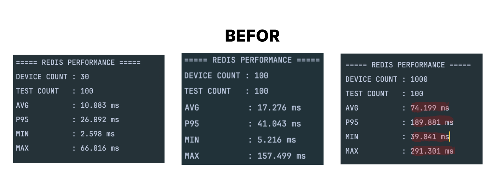
</div>

| Device | AVG | P95 | MIN | MAX |
| ---: | ---: | ---: | ---: | ---: |
| 30 | 10.083ms | 26.092ms | 2.598ms | 66.016ms |
| 100 | 17.276ms | 41.043ms | 5.216ms | 157.499ms |
| 1,000 | **74.199ms** | **189.881ms** | 39.841ms | **291.301ms** |

**After — Redis Pipeline 적용**

<div align="center">
  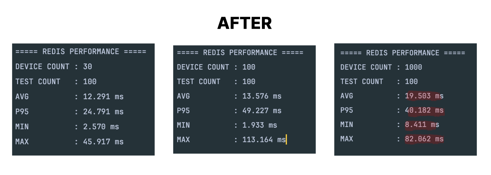
</div>

| Device | AVG | P95 | MIN | MAX |
| ---: | ---: | ---: | ---: | ---: |
| 30 | 12.291ms | 24.791ms | 2.570ms | 45.917ms |
| 100 | 13.576ms | 49.227ms | 1.933ms | 113.164ms |
| 1,000 | **19.503ms** | **40.182ms** | 8.411ms | **82.062ms** |

---

#### 5. 결과 — 규모가 증가할수록 Pipeline의 효과 증가

30대 환경에서는 평균 응답시간이 `10.083ms → 12.291ms`로 오히려 약간 증가했습니다.
장비 수가 적은 환경에서는 Pipeline 구성 및 결과 처리에 필요한 추가 비용이 상대적으로 더 크게 작용한 것으로 판단했습니다.

**1,000대 기준**

```text
AVG  74.199ms → 19.503ms  (약 73.7% 감소)
P95  189.881ms → 40.182ms (약 78.8% 감소)
MAX  291.301ms → 82.062ms  (약 71.8% 감소)
```

| Device | Before AVG | After AVG | 변화 |
| ---: | ---: | ---: | ---: |
| 30 | 10.083ms | 12.291ms | 약 21.9% 증가 |
| 100 | 17.276ms | 13.576ms | 약 21.4% 감소 |
| 1,000 | 74.199ms | 19.503ms | **약 73.7% 감소** |

---

#### 6. 배운 점

Pipeline은 모든 상황에서 무조건 빠른 것이 아니라, **요청 규모가 증가하면서 Network Round Trip 비용이 커질 때 효과가 명확해진다**는 점을 확인했습니다.

```text
반복 I/O 발견
    ↓
Network Round Trip 증가 가설
    ↓
Redis Pipeline 적용
    ↓
30 / 100 / 1,000대 부하 테스트
    ↓
AVG / P95 / MAX 비교
    ↓
규모에 따른 Pipeline 효과 확인
```

</details>

---

<div align="center">

## 🛠 Tech Stack

| Layer | Technology | Purpose |
|---|---|---|
| Frontend | React 19, TypeScript | Fleet Dashboard |
| Backend | Spring Boot 3.5, Java 17 | API / Event Processing |
| IoT | MQTT / Mosquitto | Telemetry Ingestion |
| Streaming | Kafka 3.7 | Async Event Processing |
| Realtime State | Redis 7 | Device State / Dedup / KPI |
| Persistence | PostgreSQL 16 | Event / Telemetry History |
| Realtime UI | WebSocket + STOMP | Push Updates |
| AI | Spring AI + OpenAI | Insight / Assistant |
| Monitoring | Prometheus + Grafana | Observability |
| PDF | Thymeleaf + OpenHTMLToPDF | Daily Report |
| Infra | Docker Compose / nginx | Runtime Environment |
| CI | GitHub Actions | Build / Test |

</div>

---

<div align="center">

## 🧩 Technical Decisions

</div>

### Why MQTT?

로봇과 서버 간 Telemetry 전달은
작은 메시지가 지속적으로 발생하는 구조이므로
경량 IoT 메시징 프로토콜인 MQTT를 사용했습니다.

### Why Kafka?

초기에는 MQTT 수신 시 DB 저장, 상태 갱신,
이벤트 분석을 직접 처리할 수 있었지만
수신 로직과 후속 처리의 결합도가 높아집니다.

Kafka를 중간 Event Stream으로 사용하여

- Telemetry 수신
- DB 저장
- 상태 갱신
- Event 분석

책임을 분리했습니다.

### Why Redis?

관제 화면은 과거 이력보다
"현재 장비 상태"를 매우 빈번하게 조회합니다.

따라서

**Redis** → 최신 Device State / Heartbeat / Event Deduplication / Throughput·Utilization

**PostgreSQL** → Telemetry History / Device Event / AI Analysis

로 역할을 분리했습니다.

---

<div align="center">

## 🚀 Getting Started

</div>

### 사전 요구사항

<details>
<summary><b>실행에 필요한 환경 확인하기</b></summary>

<br>

- **Docker Compose 실행**: Docker Desktop (또는 Docker Engine + Compose v2)
- **로컬 개발**
  - Node.js 22+
  - Java 17+
  - Gradle (또는 `./backend/gradlew` 사용)
  - PostgreSQL, Redis, MQTT, Kafka (Docker Compose로 기동 가능)
- **Daisy AI / PDF 리포트**: OpenAI API Key 필요

</details>

### 빠른 시작 (Docker Compose)

```bash
cd infra

# infra/.env 파일 생성
# OPENAI_API_KEY=sk-...
# SLACK_WEBHOOK_URL=https://hooks.slack.com/services/...  # Demo 알림 (선택)
# NGROK_AUTHTOKEN=...  # ngrok 터널 사용 시 (선택)

docker compose up -d --build
```

<div align="center">

| URL | 설명 |
|---|---|
| http://localhost:3000 | Frontend (Dashboard) |
| http://localhost:8080 | Backend API |
| http://localhost:9090 | Prometheus |
| http://localhost:3001 | Grafana |

</div>

데모 텔레메트리 시작:

```bash
curl -X POST http://localhost:8080/v1/demo/start
```

또는

```bash
cd infra
docker compose --profile demo up -d simulator
```

### 환경 변수

<details>
<summary><b>Frontend / Backend 환경 변수 보기</b></summary>

<br>

**Frontend**

| 변수 | 기본값 | 설명 |
|---|---|---|
| `VITE_API_BASE_URL` | `""` | API 베이스 URL. 비우면 현재 호스트 기준 상대 경로 사용 |
| `VITE_WS_URL` | 자동 | 미설정 시 `ws(s)://{host}/ws` |

**Backend**

| 변수 | 기본값 | 설명 |
|---|---|---|
| `SPRING_DATASOURCE_URL` | `jdbc:postgresql://db:5432/robotops` | PostgreSQL JDBC URL |
| `SPRING_DATASOURCE_USERNAME` | `app` | DB 사용자 |
| `SPRING_DATASOURCE_PASSWORD` | `app` | DB 비밀번호 |
| `SPRING_DATA_REDIS_HOST` | `redis` | Redis 호스트 |
| `SPRING_DATA_REDIS_PORT` | `6379` | Redis 포트 |
| `SPRING_KAFKA_BOOTSTRAP_SERVERS` | `kafka:9092` | Kafka Broker |
| `MQTT_BROKER_URL` | `tcp://mqtt:1883` | MQTT Broker URL |
| `OPENAI_API_KEY` | — | Daisy / AI 분석 / PDF 요약 |
| `SLACK_WEBHOOK_URL` | — | Demo start/stop Slack 알림 (선택) |

</details>

### Docker Compose 서비스 구성

<details>
<summary><b>컨테이너 및 포트 정보 보기</b></summary>

<br>

| 컨테이너 | 포트 | 역할 |
|---|---|---|
| `frontend` | 3000 → 80 | nginx 정적 파일 + API/WebSocket 프록시 |
| `backend` | 8080 | Spring Boot API |
| `db` | 5432 | PostgreSQL |
| `redis` | 6379 | 캐시 / 실시간 상태 |
| `mqtt` | 1883 | Mosquitto Broker |
| `kafka` | 9092 | Event Streaming |
| `simulator` | — | MQTT Robot Simulator (`demo` profile) |
| `prometheus` | 9090 | Metrics 수집 |
| `grafana` | 3001 | Monitoring Dashboard |
| `ngrok` | 4040 | 외부 HTTPS Tunnel (선택) |

</details>

### API & WebSocket

<details>
<summary><b>REST API / WebSocket Endpoint 보기</b></summary>

<br>

**REST API**

| Method | Endpoint | 설명 |
|---|---|---|
| `GET` | `/v1/dashboard/utilization` | 가동률 |
| `GET` | `/v1/dashboard/throughput` | 처리량 |
| `GET` | `/v1/dashboard/offline` | 오프라인 디바이스 |
| `GET` | `/v1/dashboard/all-events` | 전체 이벤트 |
| `GET` | `/v1/dashboard/device-list` | 디바이스 목록 |
| `GET` | `/v1/dashboard/feed` | AI 인사이트 피드 |
| `GET` | `/v1/dashboard/events/{robotId}` | 디바이스별 이벤트 |
| `POST` | `/v1/daisy/chat` | Daisy Assistant 채팅 |
| `POST` | `/v1/daisy/daily/report` | 일일 운영 PDF 다운로드 |
| `POST` | `/v1/demo/start` | 데모 세션 시작 |
| `POST` | `/v1/demo/stop` | 데모 세션 종료 |
| `GET` | `/v1/demo/status` | 데모 상태 조회 |
| `GET` | `/v1/admin/dlt` | Insight feed DLT 목록 (`?status=PENDING`) |
| `GET` | `/v1/admin/dlt/{id}` | DLT 메시지 상세 |
| `POST` | `/v1/admin/dlt/{id}/replay` | DLT 메시지 `robot.device.feed` 재발행 |
| `POST` | `/v1/admin/dlt/{id}/discard` | DLT 메시지 폐기 |
| `GET` | `/actuator/health` | Health Check |
| `GET` | `/actuator/prometheus` | Prometheus Metrics |

**WebSocket (STOMP)**

Connection: `/ws`

| Topic | 설명 |
|---|---|
| `/robot/device/state` | 디바이스 상태 |
| `/robot/device/events` | Fleet 이벤트 |
| `/robot/device/throughput` | 처리량 |
| `/robot/device/totalUtilization` | 전체 가동률 |
| `/robot/device/offline` | 오프라인 알림 |
| `/robot/device/feed` | AI Insight Feed |

</details>

---
